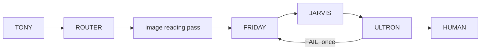

# Agent chain

Each stage of a 4CE turn: what it is for, what it reads and writes, which model
it runs on, and what happens when it fails. All of it lives in one file,
[`functions/orchestrator.py`](../functions/orchestrator.py), a pipe function
that owns the whole turn. For where the chain sits in the system, see
[ARCHITECTURE.md](ARCHITECTURE.md). For the configuration switches, see the
valve reference in [4ce/README.md](../README.md).

Described from the committed code as of `195cb9f`.

---

## TONY - classify

**Purpose.** Decide what kind of work a request is, and whether it needs the
chain at all.

**Input.** The latest user message, and whether it carries an image.

**Decision logic,** in order (`_classify`):

| Condition | Task type |
|---|---|
| An image is attached | `vision` |
| The message is entirely social or about the assistant, 8 words or fewer (`_conversational`) | `chat` |
| A code signal: "code", "script", "function", "python", "sql"... | `code` |
| A document signal: "report", "inspection", "sop", "approval note", "audit"... | `document` |
| A calculation signal: "calculate", "thickness", "pressure"... | `analysis` |
| None of the above | `analysis` |

Separately, `_wants_audit` flags a request to evidence the sovereignty claim,
and `_has_readings` flags one that carries measurements with units.

**Output.** The task type and the signals that matched. Both appear in the
provenance table.

**The conversational fast path.** A `chat` task is answered directly on the
chat model with no agents, no verification and no approval, unless the
`orchestrate_small_talk` valve is on. The matcher is strict on purpose: "hello"
is chat, while "hello, draft an approval note for pump P-101B" is a document
task. See [ADR-0008](decisions/0008-answer-conversation-directly.md).

---

## ROUTER - pick the model

**Purpose.** Choose a local model for the task type, and say why.

**Input.** The task type, the [model registry](../models.json), and the models
the model server is actually serving.

**Decision logic** (`_route`). The registry maps each task type to the
capabilities it needs (`code` needs `coding`, `vision` needs `vision`,
`document` needs `documents`, and so on). The first registry entry that has
them and is served is chosen. Every entry is recorded with its standing:
*chosen*, *lacks coding*, *not served* or *capable, not first*. A model named in
one of the `*_model` valves overrides the registry for that task type, and the
routing line says so.

**Per-agent models** (`_agent_model`). FRIDAY and JARVIS follow the routed
model unless their valve names another. ULTRON crosses to a different served
model by default, preferring entries with the `verification` capability
(`independent_verification`, on by default). See
[ADR-0003](decisions/0003-verify-on-a-different-model.md) and
[ADR-0006](decisions/0006-route-by-a-model-registry.md).

**Failure handling.** With no capable model served, it falls back to any
other served model and says so. With none at all, the turn ends with "no local
model available".

---

## Image reading pass - vision tasks only

**Purpose.** Turn an attached scan, handwritten log, drawing or photograph
into fields a reviewer can check against the pixels, before FRIDAY analyses
it (`_read_image`).

**Input.** The image, sized by kind. The request's words decide the kind
("P&ID", "drawing", "log", "scan"...), and otherwise whether the image looks
like paper:

| Kind | Sent at up to | Valve |
|---|---|---|
| Photograph | 900 px | `vision_max_edge` |
| Page or drawing | 2200 px | `vision_page_edge` |

**Model.** FRIDAY's model, the routed vision model by default. The reply
budget is `extraction_max_tokens` (2400).

**Output.** A numbered table of fields: value or tag, unit, the model's
confidence, and the box it was read from. P&ID tags are typed from their ISA
5.1 letters where 4CE knows them, so `FE-101` is an instrument whatever the
model filed it under. 4CE draws the boxes on a PNG copy, numbered as the
table is. The table and the copy go into the draft, the released answer, the
Word report and the deck. Readings from the page go to the SOP rule pack
exactly as a request's own readings do.

**Failure handling.** Fields finished before a reply was cut off are kept.
With no readable image, a failed call or no fields, FRIDAY reads the image
unaided, and the rule pack then assesses FRIDAY's reading instead (except for
a drawing, which carries tags rather than readings). Anything read with less
than full confidence is marked **check** and listed under the checks, by
number.

**Switch.** `vision_extraction`, on by default. Measured by
`eval_vision.py`; see [TESTING.md](TESTING.md#vision-evaluation---eval_visionpy).

---

## Deterministic steps - before any agent

These run in code, not on a model, and their output is handed to the agents as
authoritative. See [ADR-0004](decisions/0004-deterministic-tools-for-arithmetic.md).

| Step | Runs when | Tool | Output |
|---|---|---|---|
| Retrieval | `document`, `vision` or `analysis` task, and not an audit | platform retrieval over the collections attached to the orchestrator's model | Up to `retrieval_k` (4) passages that pass the relevance guard, numbered as sources `[1]`, `[2]`... |
| Sovereignty audit | `_wants_audit` | `verify_sovereignty` | The 18-surface configuration table beside the observed egress |
| SOP rule pack | `document`, `analysis` or `vision` task whose request carries readings, or any image the reading pass read | `check_sop_thresholds` | A clause-cited verdict per parameter; `NO DATA` where a reading is missing |
| Remaining life | any work task asking for remaining life, corrosion rate or similar | `calculate_remaining_life` | Each step with its units; the next inspection capped by the interval the SOP requires |

**The relevance guard.** Vector search always returns its nearest chunks, even
for an unrelated question. A passage is kept only if it shares a word of
substance with the request, or if its similarity is at least
`retrieval_strong_score` (0.8). When a knowledge base was searched and nothing
survived, FRIDAY is told to say the plant documents do not cover the question.

---

## FRIDAY - ground and analyse

**Purpose.** Work out what the documents and readings actually support.

**Input.** The request, the numbered passages, the deterministic findings,
and, on a second try, ULTRON's objections. On a vision task, the image at
the size its kind needs, with the reading pass's field table.

**Model.** The routed model unless `friday_model` names another.

**Instructions.** Work only from the supplied context, separate fact from
assumption, and say plainly when the evidence is insufficient. Cite passages
as `[n]`. The requester's own readings are data, used as given.

**Output.** An analysis for JARVIS. On a vision task where the reading pass
produced nothing, the SOP rule pack assesses FRIDAY's reading of the page
instead.

**Failure handling.** A model error ends the turn with a failure card that
names the cause (for example, a request longer than the 8192-token context)
and the fix.

---

## JARVIS - produce the deliverable

**Purpose.** Turn FRIDAY's analysis into the finished work product.

**Input.** The request, FRIDAY's analysis, the deterministic findings, and
guidance on the output shape: a direct answer first, then only the sections
the request needs, in the order *Details*, *What to do*, *Limits*. Code must be
fenced, and must assert its own result.

**Model.** The routed model unless `jarvis_model` names another.

**After JARVIS.**

- `_tidy` removes the clutter a small model adds (title lines, rules,
  sign-offs, bold pseudo-headings), so the text ULTRON checks is the text that
  is fingerprinted and released.
- On a `code` task, every Python block is joined in order and run with
  `run_python`. Code the model forgot to fence is recovered with the Python
  parser. The sandbox's report is appended to the deliverable.

---

## ULTRON - challenge

**Purpose.** Find what is wrong with the deliverable before a person sees it.

**Input.** The request, the deliverable, and the deterministic findings,
marked as correct and not to be re-derived. ULTRON is not shown the retrieved
sources. On a vision task it is told the source was an image it cannot see, so
it judges consistency and arithmetic rather than failing for lack of access.

**Model.** A different served model from JARVIS by default. It runs with
thinking off (`/no_think`), so its token budget goes on the check lines.

**Output.** PASS or FAIL on the first line, then one line per claim: `OK:`,
`PROBLEM:` or `UNVERIFIED:`.

**4CE's own checks,** applied on top of ULTRON's verdict:

| Check | Fails the result when |
|---|---|
| Execution (`_execution_check`) | There was no code block; the code crashed, timed out or failed an assertion; or the request asked for printed output and nothing was printed |
| Figures (`_figure_checks`) | A figure cited to source `[n]` does not appear in source n, or a figure attributed to the SOP appears in no passage, reading, rule-pack verdict or calculation. A true figure given the wrong source is shown as mis-cited, not invented |
| Verdicts (`_verdict_checks`) | The answer calls a reading within limits when the rule pack's verdict for it is REVIEW or FAIL |
| Readings (`_reading_checks`) | Never fails; lists each field the reading pass was unsure of, by number, for the reviewer to check against its box |

A clean run that asserts nothing is shown as *could not check*, not as a pass.
Code that could not be run at all, for example because Docker is down, is
*unverified* and final, since a second try cannot start a sandbox. A PASS that
still lists objections is released as "Passed by ULTRON, with N reservations",
in amber.

---

## TONY - replan

On a FAIL, and only once (`enable_replan`), FRIDAY and JARVIS run again with
the objections attached. The two drafts are compared sentence by sentence, and
the answer carries a "What changed on try 2" section that pairs each objection
with the lines changed for it. A second FAIL is delivered with the failure
recorded rather than looped.

---

## HUMAN - sign-off

**Purpose.** Nothing is released until a person has read it and said so.

**Input.** The draft, ULTRON's verdict and reservations, the checks, the
passages behind each `[n]`, and what a second try changed. This reaches the
sign-off panel as structured data (`kind: 4ce_approval`), with a plain text
fallback for a frontend without the panel.

**Decision.** Only `approve` or `approved` releases. An empty box, any other
word or a cancel withholds. A prompt that reached nobody (a reload, a closed
tab, the 30-minute timeout) is recorded as *not obtained*, not as rejected.
With no interactive session at all, the result is marked unapproved. The
reviewer's waiting time is excluded from the working time reported. See
[ADR-0002](decisions/0002-fail-closed-human-approval.md).

**Switch.** `require_approval`, on by default. Preflight warns if it is off.

---

## Release

Only after approval, or when approval is not required:

1. The released text is fingerprinted with SHA-256. The receipt, the
   provenance table and the Word report all carry the fingerprint, so a copy
   can be checked against the record.
2. Each fenced code block becomes a typed file (`save_artifact`). Blocks of the
   same language are joined, and only ordinary text types are allowed.
3. A request that names Excel or PowerPoint gets `create_spreadsheet` or
   `create_presentation`. A document or vision task gets `create_word_document`,
   with the approval record, the checks, the cited sources and any revisions.
4. The answer ends with a receipt (model, grounding, verdict, who released it,
   working time, external connections observed during the run) and the full
   provenance table.

---

## Stopping a run

The Stop button cancels the turn. The orchestrator catches the cancellation,
closes the status line with "Stopped by reviewer", records the tokens already
spent, and writes the turn to the chat saying nothing was released.

---

## Related documentation

- [ARCHITECTURE.md](ARCHITECTURE.md) - where the chain sits in the system
- [TESTING.md](TESTING.md) - what checks each stage
- [SOP_THRESHOLD_PLAN.md](SOP_THRESHOLD_PLAN.md) - design of the rule-pack engine
- [DEMO_SCRIPT.md](DEMO_SCRIPT.md) - the chain shown stage by stage on real prompts
- [decisions/](decisions/) - why each stage works the way it does
