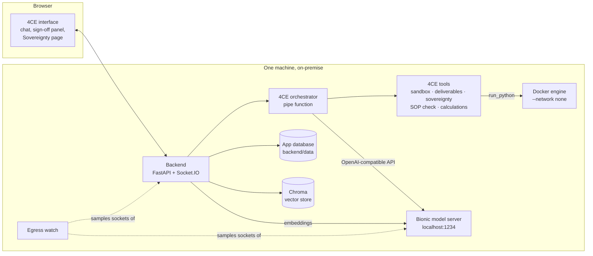
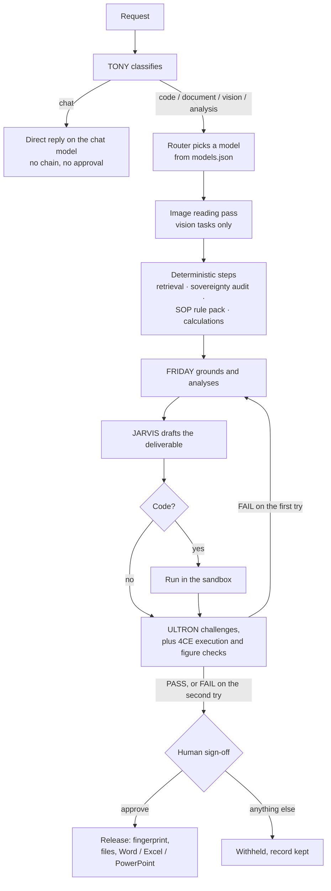

# Architecture

How 4CE is put together: what runs where, how one request moves through it,
and where the trust boundaries sit. The agent-by-agent detail is in
[AGENT_CHAIN.md](AGENT_CHAIN.md); the reasons behind the major choices are in
[decisions/](decisions/).

Described from the committed code as of `195cb9f`.

---

## System overview

Everything in the diagram runs on one host. The only network path the design
needs is loopback: browser to backend, and backend to the model server.

---

## Components

### The 4CE plugin layer - `4ce/`

Loaded into the running application at runtime by
[`install.py`](../install.py). This is where the agent logic lives.

| Component | Registered as | Entry points |
|---|---|---|
| [`functions/orchestrator.py`](../functions/orchestrator.py) | `ace_orchestrator`, shown as **4CE / TONY (Orchestrator)** | `pipe()` - owns the whole turn |
| [`tools/sandbox.py`](../tools/sandbox.py) | `ace_sandbox` | `run_python` |
| [`tools/deliverables.py`](../tools/deliverables.py) | `ace_deliverables` | `create_word_document`, `create_spreadsheet`, `create_presentation`, `save_artifact` |
| [`tools/sovereignty.py`](../tools/sovereignty.py) | `ace_sovereignty` | `verify_sovereignty` |
| [`tools/sop_check.py`](../tools/sop_check.py) | `ace_sop_check` | `check_sop_thresholds` |
| [`tools/calculations.py`](../tools/calculations.py) | `ace_calculations` | `calculate_remaining_life` |
| [`models.json`](../models.json) | written into the orchestrator's `model_registry` valve | the routing registry |

Plugin ids are `ace_*` because the runtime requires valid Python identifiers,
and `4ce_*` starts with a digit.

Besides deploying the plugins, `install.py` attaches the five tools to the
orchestrator's model record, restricts the chat model picker to the routed
models, blanks the third-party image and speech endpoints the platform ships
with, sets the starter prompts, and rebuilds the **Plant SOPs** knowledge base
from [`demo/samples/`](../demo/samples/) if it is missing. It is idempotent:
anything already correct is left alone.

### Backend additions - `backend/open_webui/`

A plugin cannot reach everything, so a small set of backend files was added or
changed:

| File | What it adds |
|---|---|
| `utils/fource_egress.py` | The egress watch: samples the socket table every 250 ms and classifies each connection held by the backend, the model server and the frontend dev server. See [ADR-0007](decisions/0007-observe-egress-rather-than-assert-it.md). |
| `routers/fource.py` | `/api/v1/fource/egress`, `/egress/canary`, `/egress/reset`, `/models`, `/audit` |
| `main.py` | Starts and stops the egress watch with the app, and mounts the router |
| `socket/main.py` | Re-sends a pending sign-off to the same user's live sessions when the reviewer's tab reconnects |
| `utils/fource.py`, `models/chats.py`, `routers/chats.py` | Reads each chat's run outcome (released, withheld, stopped) for the sidebar marks |

### Frontend additions - `src/lib/components/`

| Surface | Main files |
|---|---|
| Live chain: stage rail, status line, animated mark | `chat/Messages/ResponseMessage/StageRail.svelte`, `StatusHistory/LiveStatusLine.svelte`, `common/LogoMotion.svelte` |
| Sign-off panel, docked in place of the message box | `chat/ApprovalPanel.svelte`, `chat/approvalReview.js` |
| Receipt, checks, audit record, revisions, report card | `chat/Messages/Markdown/ReceiptStrip.svelte`, `AuditSheet.svelte`, `RevisionCard.svelte`, `FileCard.svelte`, `ReportThumb.svelte` |
| Trust view and route preview | `chat/Messages/trustView.js`, `chat/MessageInput/RoutePreview.svelte` |
| Sovereignty page and navbar egress count | `fource/Sovereignty.svelte`, `fource/EgressIndicator.svelte`, route `src/routes/(app)/sovereignty/` |
| Run overview tree | `chat/Overview/` |
| Failure card | `chat/Messages/ResponseMessage/RunErrorCard.svelte` |
| Withdrawn surfaces | `chat/SettingsModal.svelte`, `chat/MessageInput/InputMenu.svelte`, `chat/Settings/Audio.svelte`, `chat/Settings/Account/UserProfileImage.svelte` |

### Local services

| Service | Role | Configured in |
|---|---|---|
| Bionic, `http://localhost:1234/v1` | Chat, vision and embedding inference | `.env` at the repository root, copied from [`env.sovereign.example`](../env.sovereign.example) |
| Docker, image `python:3.12-alpine` | Disposable containers for generated code | the sandbox tool's valves |
| Chroma | Vector store on local disk, telemetry disabled | `VECTOR_DB=chroma` |
| App database and uploads | Chats, users, plugin code, files | `backend/data/` by default |

The models are listed in the [model registry](../models.json):
`qwen/qwen3-vl-4b` for documents, images and analysis, `qwen/qwen3-1.7b` for
code and chat, and `text-embedding-nomic-embed-text-v1.5` for retrieval. The
two chat models are loaded at 8192 context; see
[ADR-0005](decisions/0005-load-models-at-8192-context.md).

---

## One request, end to end

1. **Classify.** TONY reads the request and picks a task type from keyword
   signals: `vision` if an image is attached, `chat` for purely social
   messages, otherwise `code`, `document` or `analysis`.
2. **Route.** The router takes the first model in `models.json` that is served
   and has the capabilities the task type needs, and records why every other
   entry was passed over.
3. **Read the image, if there is one.** A reading pass on the vision model
   turns the image into numbered fields (value or tag, unit, confidence, and
   the box it was read from), and 4CE draws the boxes on a numbered copy.
   Pages and drawings are sent at up to 2200 px, photographs at 900.
4. **Deterministic steps.** Retrieval runs for document, vision and
   analysis tasks. An audit request runs `verify_sovereignty`. Readings in the
   request, or read from the image, go to the SOP rule pack, and a
   remaining-life request goes to the calculation tool. Their output reaches
   the agents marked as authoritative.
5. **FRIDAY, then JARVIS.** FRIDAY grounds and analyses; JARVIS writes the
   deliverable. Generated code is then executed in the sandbox.
6. **Verify.** ULTRON, on a different model from JARVIS by default, returns
   PASS or FAIL with one line per claim. 4CE's own checks can fail the result
   whatever ULTRON concluded: a failed execution, a figure cited to a source
   that does not contain it, or a reading called within limits that the rule
   pack did not pass.
7. **Replan once.** On a FAIL, FRIDAY and JARVIS run again with the objections
   attached. A second FAIL is delivered with the failure recorded.
8. **Sign-off.** The reviewer must type `approve`; anything else withholds.
   See [ADR-0002](decisions/0002-fail-closed-human-approval.md).
9. **Release.** The answer is fingerprinted with SHA-256, code blocks become
   typed files, and a Word, Excel or PowerPoint file is written as the request
   asks. Every answer carries a receipt and a provenance table.

Live status events are emitted at each step, so the interface's stage rail
shows the chain as it actually runs.

---

## Storage

| What | Where |
|---|---|
| Chats, receipts, provenance, approval record | App database, `backend/data/` |
| Uploaded documents and released files | The platform's local storage provider, and also the directory in a tool's `output_dir` valve, if one is set |
| Document vectors | Chroma, on local disk |
| Plugin source | App database, deployed from `4ce/` by `install.py` |
| Model registry | `4ce/models.json`, copied into the orchestrator's valve on install |
| Knowledge base definition | `install.py` and `4ce/demo/samples/`, so it can be rebuilt |

---

## Trust boundaries

The full threat model is in [`SECURITY.md`](../../SECURITY.md). In short:

- **Inference and embeddings** go only to the configured local endpoint.
  `verify_sovereignty` audits that configuration across 18 surfaces.
- **Egress is observed, not prevented.** The egress watch samples sockets; it
  does not capture packets, and it misses connections that open and close
  between samples, and DNS. A host firewall rule is what prevents egress, and
  the canary on the Sovereignty page tests that rule.
- **Generated code** runs in a container with no network, a read-only root,
  all capabilities dropped, and CPU, memory, process and time caps.
- **Plugins run with the server's privileges.** They are trusted code.
- **Release requires a person.** With no interactive session the approval is
  recorded as *not obtained*, never as granted.

---

## External dependencies at runtime

None beyond the machine. Building needs the network (npm packages, the
Pyodide bundle, Python wheels, model downloads); running does not. The one
background connection observed on the demo machine was the model server
checking for its own updates. It is documented, with the firewall rule that
blocks it, in [HOW_TO_RUN.md](HOW_TO_RUN.md#making-it-physical).

---

## Related documentation

- [AGENT_CHAIN.md](AGENT_CHAIN.md) - each agent's inputs, outputs, models and failure handling
- [TESTING.md](TESTING.md) - how each claim above is checked
- [decisions/](decisions/) - why it is built this way
- [4ce/README.md](../README.md) - valve reference
- [HOW_TO_RUN.md](HOW_TO_RUN.md) - running it
