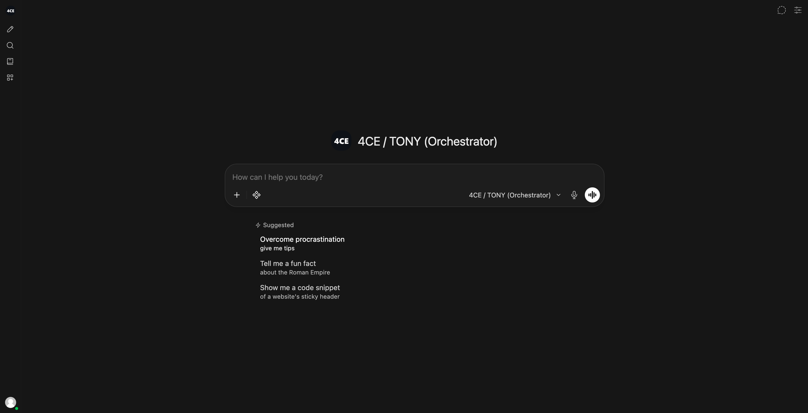

# 4CE

**A sovereign, on-premise agentic AI workbench.** Every model call, every document
and every byte of context stays on hardware you control — no cloud API, no
telemetry, no data leaving the building.

Built for Smart India Hackathon PS 26117.

 

---

## Contents

- [What it is](#what-it-is)
- [Why it matters](#why-it-matters)
- [Quick start](#quick-start)
- [The plugin set](#the-plugin-set)
- [Verification status](#verification-status)
- [Repository layout](#repository-layout)
- [Security](#security)
- [Contributing](#contributing)
- [Attribution and licence](#attribution-and-licence)

---

## What it is

Most local-LLM front-ends give you a chat box. 4CE gives you an **agent chain with
a verification step and a human gate**, running entirely against a local model
server.

A single turn routes itself across multiple models by task type, grounds the answer
in your own documents, produces a deliverable, challenges that deliverable, and then
withholds it until a person approves.

```
TONY      classify the task (chat | code | vision | document | analysis)
ROUTER    pick the local model for that task type, and say why
FRIDAY    ground and analyse against local RAG
JARVIS    produce the deliverable
ULTRON    challenge it -> PASS / FAIL
TONY      replan once on FAIL, re-running FRIDAY and JARVIS
HUMAN     approve or reject before release
```

Every step is emitted as a live status event, so the chain is visible in the UI as
it actually executes — never simulated.

### Reasoning is shown, not claimed

Each answer carries an expandable **Agent reasoning** block per step: the task type
and the signals that matched it, the model chosen and the full candidate routing
table, each agent's output with its model and timing, and the model's own `<think>`
content stripped out of the deliverable and shown separately.

---

## Why it matters

| Property | How 4CE gets it |
|---|---|
| **Sovereign** | Local model server only. `OFFLINE_MODE=true`, no telemetry, no community sharing, no web search. |
| **Verified** | ULTRON challenges JARVIS's output and can force a replan. Run it on a *different* model so nothing grades its own work. |
| **Human-gated** | The approval dialog fails closed — an empty box, a wrong word, a cancel or a timeout all withhold the deliverable. |
| **Auditable** | An execution trace is appended to every answer. |
| **Multimodal** | Image parts are detected and routed to the vision model. |

---

## Quick start

Requires a local OpenAI-compatible model server (LM Studio, Bionic Studio) on
`http://localhost:1234`.

```bash
cp 4ce/env.sovereign.example .env
```

Start the backend, then load the plugin set:

```bash
python 4ce/install.py
```

Select **4CE / TONY (Orchestrator)** in the model picker. The installer attaches
the tool set to that model, so the agents can call it straight away.

Full setup, configuration valves and troubleshooting: **[`4ce/docs/HOW_TO_RUN.md`](4ce/docs/HOW_TO_RUN.md)**

---

## The plugin set

Everything under [`4ce/`](4ce/) is this project's own code, loaded into the running
app at runtime.

| Component | What it does |
|---|---|
| [`functions/orchestrator.py`](4ce/functions/orchestrator.py) | The agent chain. Registers as a selectable model and owns the whole turn. |
| [`tools/sandbox.py`](4ce/tools/sandbox.py) | Runs generated Python in a disposable container — no network, read-only root, all capabilities dropped, hard CPU/memory/PID/time caps. |
| [`tools/deliverables.py`](4ce/tools/deliverables.py) | Renders agent output into a formatted `.docx` with a classification banner and reference table. |
| [`tools/sovereignty.py`](4ce/tools/sovereignty.py) | Audits live configuration for anything that could carry data off-premise, and returns a pass/fail table. |
| [`tools/sop_check.py`](4ce/tools/sop_check.py) | Compares readings against an authored rule pack and cites the clause that decided each one. Arithmetic, not inference. |

The chain calls these itself: threshold comparisons go to `sop_check` rather than
being reasoned out, generated code is executed before it is shown, an audit
request reads the running configuration, and an approved document is written to
`.docx`. Which tools ran is recorded in the provenance table of every answer.

See [`4ce/README.md`](4ce/README.md) for the valve reference and design notes.

---

## Verification status

Verified against a running instance with LM Studio serving `qwen3-vl-4b`,
`qwen3-1.7b` and `text-embedding-nomic-embed-text-v1.5`.

| Capability | Status |
|---|---|
| Model auto-selection across task types | Verified — coding routes to `qwen3-1.7b`, documents to `qwen3-vl-4b`, rationale shown |
| Per-agent model assignment | Verified — ULTRON crosses to a different model from JARVIS by default, so nothing grades its own work |
| Agentic chain end to end | Verified — FRIDAY → JARVIS → ULTRON with a TONY replan on failure |
| Verification catches errors | Verified — ULTRON rejected fabricated inspection readings and forced a replan |
| Deterministic thresholds | Verified — `sop_check` cited `§2.2` for an 18 drops/min seal leak and returned NO DATA, not PASS, where a reading was absent |
| Human approval | Verified — approve releases and writes the `.docx`; empty box and cancel both withhold, and no file is written |
| Sandboxed code execution | Verified — 6/6 checks, including blocked network and enforced timeout |
| Word deliverables | Verified — 7/7 checks, valid OOXML |
| Sovereignty audit | Verified — 11/11 surfaces pass on the demo configuration |
| Local RAG | Verified — upload, embed, index and query in ~0.3 s |
| Multimodal / vision | Verified — read a scanned inspection report and extracted discharge pressure 18.6 bar g, wall thickness 11.2 mm against a 9.5 mm retirement thickness, bearing temperature 71 °C against an 80 °C alarm, and vibration 4.1 mm/s ISO 10816 Zone B |
| Speech to text | Verified — `faster-whisper` runs locally from a pre-cached model, so the microphone needs no network |

---

## Repository layout

Everything this project wrote lives under [`4ce/`](4ce/). The rest of the tree is the
upstream application, whose paths are fixed by SvelteKit and the Python package and
so are deliberately left alone.

```
4ce/
├── README.md              valve reference and design notes
├── install.py             deploys the plugin set into a running instance
├── test_tools.py          tool test suite
├── env.sovereign.example  the air-gapped configuration
├── functions/             the agent chain (registers as a selectable model)
├── tools/                 sandbox · deliverables · sovereignty · SOP thresholds
├── branding/              asset generators and the logo sources
├── demo/                  synthetic sample documents and their generator
└── docs/                  setup, research notes, design notes, images
```

---

## Security

The threat model, the trust boundaries and what "sovereign" does and does not
cover are documented in [`SECURITY.md`](SECURITY.md). It is worth reading before
taking the air-gap claim at face value: the sovereignty audit checks
configuration, not packets.

---


